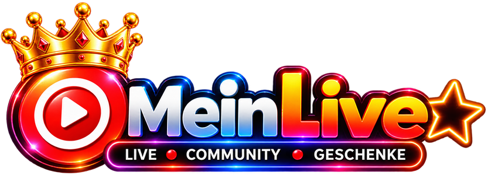

  

<h1 align="center">MeinLive Studio</h1>

  Das Streaming-Programm für <a href="https://meinlive.de">meinlive.de</a> – professionell live gehen, 
  mit deinem MeinLive-Konto, deinem Chat und deinen Einblendungen direkt eingebaut.

  <a href="https://meinlive.de/studio"><b>⬇ Download für Windows</b></a>

---

## Was kann MeinLive Studio?

- **Mit MeinLive anmelden** – einmal einloggen, der Stream-Key wird bei jedem Start automatisch geholt. Kein Kopieren von Schlüsseln mehr.
- **Live gehen mit Titel und Kategorie** – direkt aus dem Programm, inklusive „Aufzeichnen“ für deine Mediathek.
- **Einblendungen fertig eingebaut** – Chat, Geschenke, Geschenk-Ziel und Umfrage landen automatisch als Quellen in deiner Szene.
- **Szenen-Vorlagen** – Hochformat (wie in der App) oder Querformat, mit Kamera, Mikrofon und Einblendungen.
- **Live-Steuerung und Chat als Fenster** – Zuschauer, Status und „Stream beenden“ immer im Blick.
- **Automatische Updates** – MeinLive Studio meldet neue Versionen selbst und installiert sie auf Wunsch.
- **Alles aus OBS Studio** – Szenen, Quellen, Filter, Plugins, Aufnahme, virtuelle Kamera.

## Download

Die aktuelle Version gibt es immer auf **[meinlive.de/studio](https://meinlive.de/studio)**.
Voraussetzung: Windows 10 oder 11 (64 Bit).

## Basiert auf OBS Studio

MeinLive Studio ist eine angepasste Version von [OBS Studio](https://obsproject.com) – vielen Dank an das
OBS-Projekt und alle Mitwirkenden! MeinLive Studio ist kein offizielles Produkt des OBS-Projekts.

Wie OBS Studio steht MeinLive Studio unter der **GNU General Public License v2 (oder neuer)**, siehe [COPYING](COPYING).
Der vollständige Quelltext jeder veröffentlichten Version liegt in diesem Repository.
Die ursprüngliche OBS-Beschreibung findest du in [README-OBS.rst](README-OBS.rst).

## Für Entwickler

| Ordner / Datei | Inhalt |
|---|---|
| `frontend/meinlive/` | MeinLive-Funktionen (Konto, Live gehen, Einblendungen, Vorlagen, Updates) |
| `frontend/data/themes/Yami_MeinLive.ovt` | Farbschema im Stil von meinlive.de |
| `meinlive/branding/` | Logo-Vorlage und Skripte für Symbole und Texte |
| `meinlive/installer/` | Windows-Installer (Inno Setup) |
| `meinlive/studio-version.cmake` | Versionsnummer von MeinLive Studio |
| `.github/workflows/meinlive-build.yaml` | Build auf GitHub Actions |

Gebaut wird automatisch auf GitHub Actions (Reiter „Actions“). Neue OBS-Versionen werden über den
Zweig `master` (Kopie von obsproject/obs-studio) übernommen; danach
`python meinlive/branding/rebrand_locale.py` und `python meinlive/branding/make_icons.py` ausführen.
